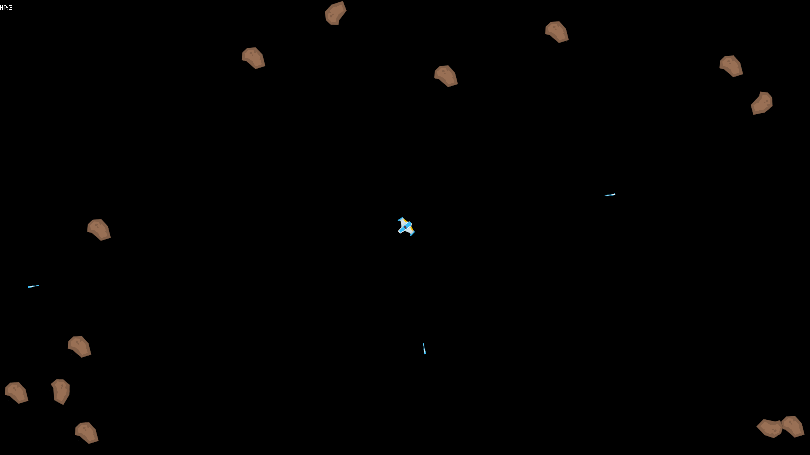

# Kenney Asteroids

**Play button place holder** **Download last windows version button place holder**

Classical implementation or the [Asteroids Game](https://en.wikipedia.org/wiki/Asteroids_(video_game)) with some adjustments. You control small space ship and you taks is simple - **survive**!

## Releases
* [v0.3.0](doc/release-notes/v0.3.0.md)
* [v0.2.0](doc/release-notes/v0.2.0.md)
* [v0.1.0](doc/release-notes/v0.1.0.md)

## Tech Stack
* [.net core 3.1](https://dotnet.microsoft.com/download/dotnet/3.1)
* [MonoGame 3.8](https://www.monogame.net/downloads/)
* [Scrutor](https://github.com/khellang/Scrutor)
* [Comora](https://github.com/dotnet-ad/Comora)
* [Newton.Json](https://www.newtonsoft.com/json)
* [BenchmarkDotNet](https://github.com/dotnet/BenchmarkDotNet)
* [Quake Console](https://github.com/discosultan/quake-console)

[Roadmap](https://github.com/iivchenko/mg-box/milestones)

# License
* Source Code
    * Well some mine and some from Xna samples 
    * [MIT License](doc/source-code-mit-license)
* Graphics
  * [Space Shooter Redux](https://kenney.nl/assets/space-shooter-redux) 
    * Thank you Kenney for the great assets!
    * [Repo Asset](src/KenneyAsteroids.Desktop/Content/SpriteSheets/asteroids.sprite.png)
    * [CC0 1.0 License](https://creativecommons.org/publicdomain/zero/1.0/)
* Sfx
  * [Space Shooter Redux](https://kenney.nl/assets/space-shooter-redux)
    * Thank you Kenney for the great assets!
    * [Repo Asset](src/KenneyAsteroids.Desktop/Content/Sounds/laser.sound.ogg)
    * [CC0 1.0 License](https://creativecommons.org/publicdomain/zero/1.0/)
* Music
    * [Dreamy Space Soundtrack](https://chiphead64.itch.io/dreamy-space-soundtrack)
      * Thank you chiphead64 for the great assets!
      * [Repo Asset](src/KenneyAsteroids.Desktop/Content/Music/menu.song.mp3)
      * [CC BY 4.0 License](https://creativecommons.org/licenses/by/4.0/)
    * [FREE Music Pack 4: Electronic 2](https://joshua-mclean.itch.io/free-music-pack-4)
      * Thank you Joshua McLean for the great assets!
      * [Repo Asset](src/KenneyAsteroids.Desktop/Content/Music/game1.song.mp3)
      * [CC BY 4.0 License](https://creativecommons.org/licenses/by/4.0/)